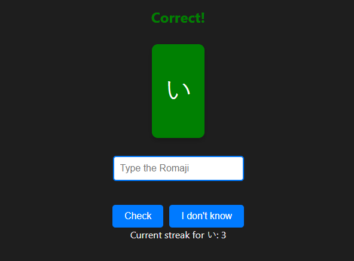

# Kana Flashcards

**Kana Flashcards** is an interactive app designed to help you learn and practice the Hiragana and Katakana characters in Japanese. You can customize the number of cards, the practice mode, and much more. It's perfect for both beginners and those looking to reinforce their knowledge of the Japanese writing system.



## Features

- Practice Hiragana, Katakana, Dakuon, Yoon.
- Customize the number of cards for practice.
- Visual feedback on answers (green for correct, red for incorrect).
- Track learning streaks and statistics.
- Friendly user interface with light and dark mode options.
- Option to mark an answer as "I don't know" (this marks it as incorrect).
  
## Installation

### Clone the repository

```bash
git clone https://github.com/yourusername/kana-flashcards.git
